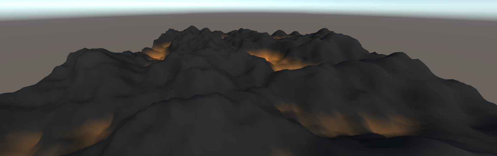
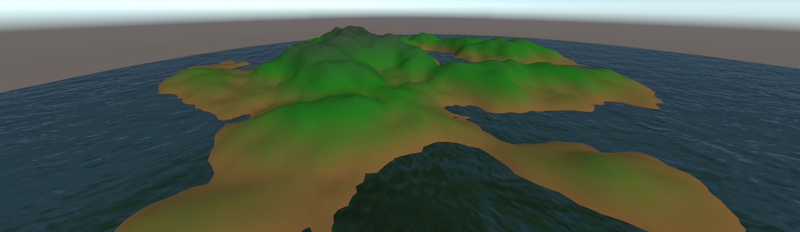
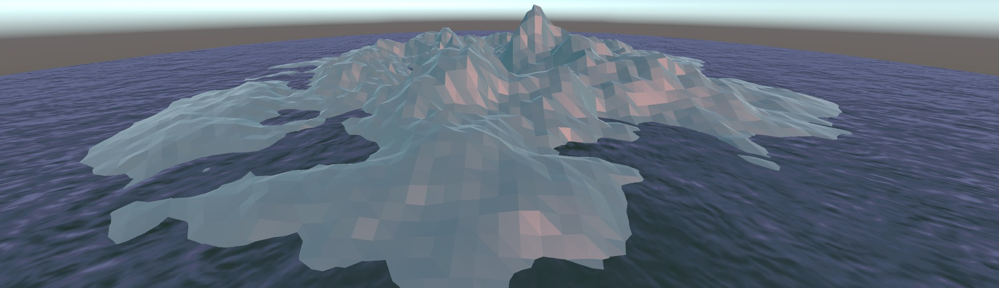
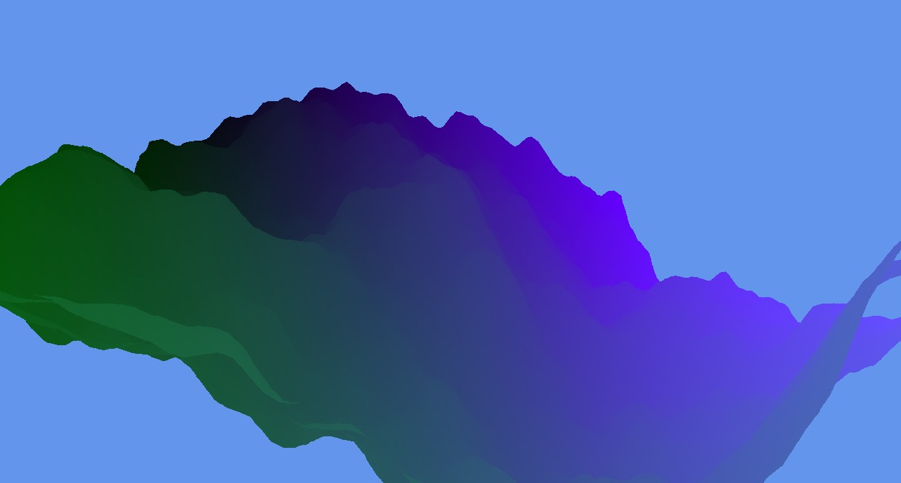
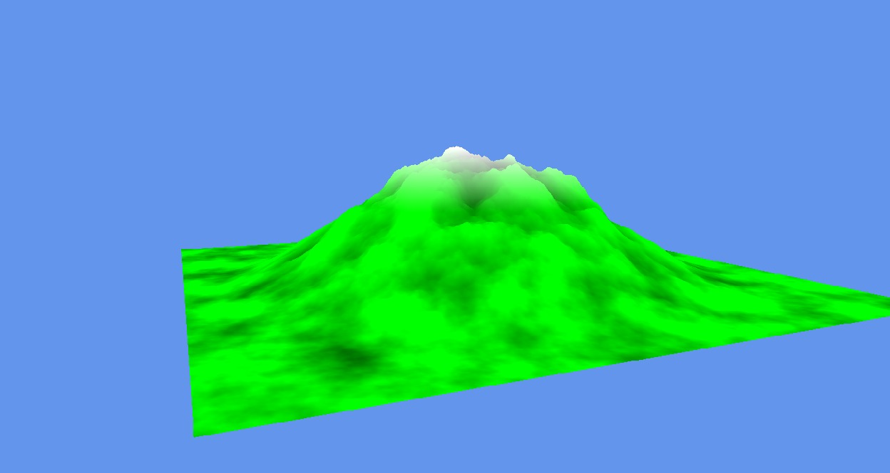
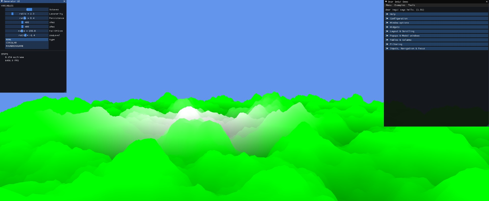
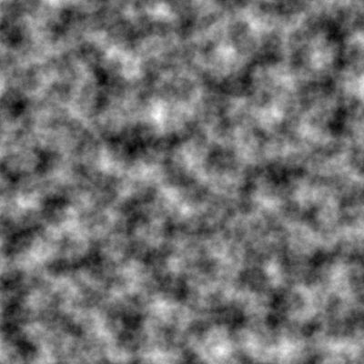
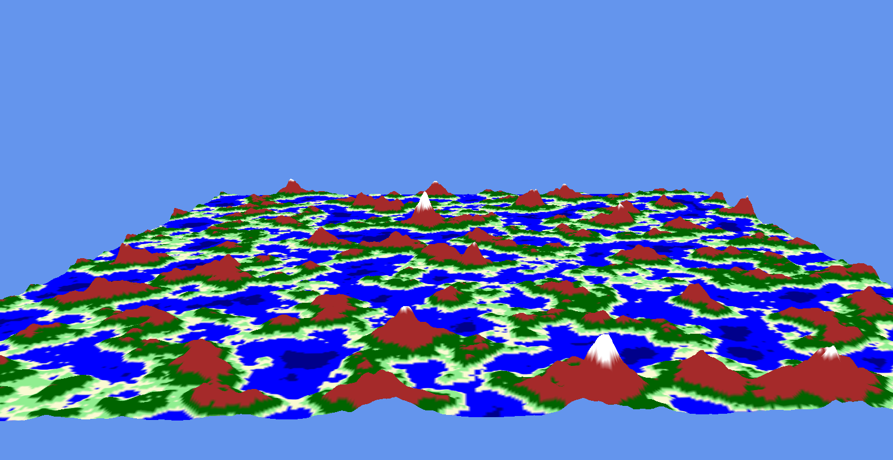
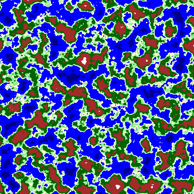

# ProceduralTerrainGeneration
## Description
The original idea was to research and try to implement terraforming in my own engine. But after the GPU Instancing I came to the conclusion that I needed a terrain mesh to do that and I didn’t want to make my own in 3DS Max. So here comes the procedural terrain generation into play. Only problem was that I knew nothing about procedural generation.

## From zero to learning hero
Due to the fact that I know nothing about procedural generation, I started by searching for an introduction course. This gave me the following results in my unity prototype. 
[Course](https://www.udemy.com/course/coding-in-unity-procedural-mesh-generation/)
This course gave me the basic knowledge to go on in my journey to implement a procedural terrain generator in the Vanaheim Engine.  

  

  

  

## 1st implementation
With the knowledge that I got from the course that I did, I tried to implement a first version inside my own engine which kinda worked but did not gave me the results that I wanted at all.

First I got a terrain (left) that didn’t listen to any parameter at all. Then I got a mountain landscape (middle) which flattened out to the edge of the terrain. At the end of my first version I got a flat landscape for which I implemented a “Unity Inspector inspired” UI with IMGUI to be able to edit variables live.

  

  

  

## Restart certain parts
Due to the fact that I was stuck with the first version, I just started again and found a tutorial which said to export the generated noise to a noise map. This sparked the idea to then use that noise map inside the vertexshader. Inside the vertexshader I use the noise map to sample the height. The sampled height I I also used the generated noise map to generate a colormap that I also use inside the pixelshader.

  

### Noise map
The noise is generated using the Fractal and Perlin noise functions.

  

### Generated Terrain
The terrain is getting its height by putting the value from the noisemap into an exponential function with a height multiplier. This is done because of the value range of [0,1] which gives a very flat surface. The exponential function ensures that the height multiplier has very little effect on the water.

  

### Color map
The colormap is generated by defining terrains and there heights. For example water has a max height of 0.1 (Noise is generated with a value range of [0,1]). 

## Code snippets
[Pixel Shader](https://github.com/SteveVerhoeven/ProceduralTerrainGeneration/blob/main/DevGame/Resources/Shaders/PosCol3D_ProceduralGenerator.fx)

[Perlin Noise](https://github.com/SteveVerhoeven/ProceduralTerrainGeneration/blob/main/VanaheimEngine/NoiseGenerator.cpp)

[Vertex Shader](https://github.com/SteveVerhoeven/VanaheimEngine/blob/master/VanaheimEngine/Game.cpphttps://github.com/SteveVerhoeven/ProceduralTerrainGeneration/blob/main/DevGame/Resources/Shaders/PosCol3D_ProceduralGenerator.fx)

## Credits
### Introduction Course
[Coding in Unity](https://www.udemy.com/course/coding-in-unity-procedural-mesh-generation/)

### Noise map & Color map idea
[Procedural Landmass Generation (E02: Noise Map)](https://www.youtube.com/watch?v=WP-Bm65Q-1Y&list=PLFt_AvWsXl0eBW2EiBtl_sxmDtSgZBxB3&index=3)

### Perlin noise function
[Understanding Perlin Noise](https://adrianb.io/2014/08/09/perlinnoise.html)
